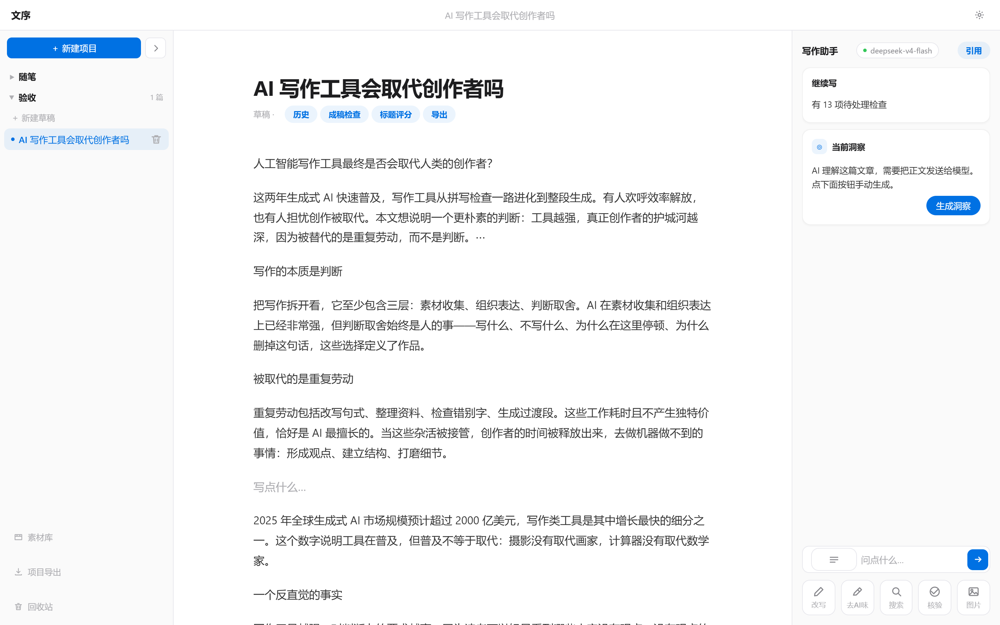
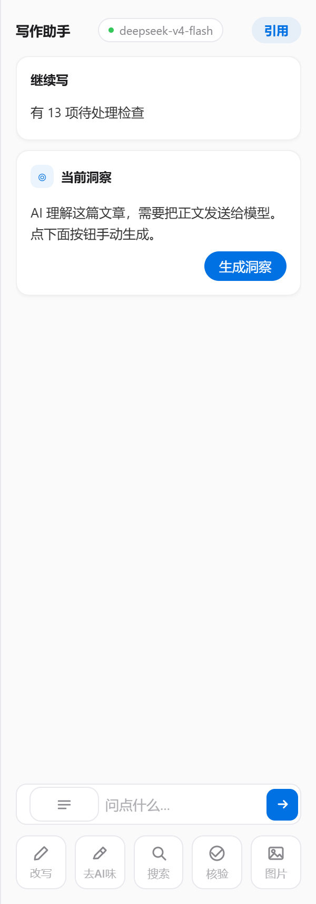
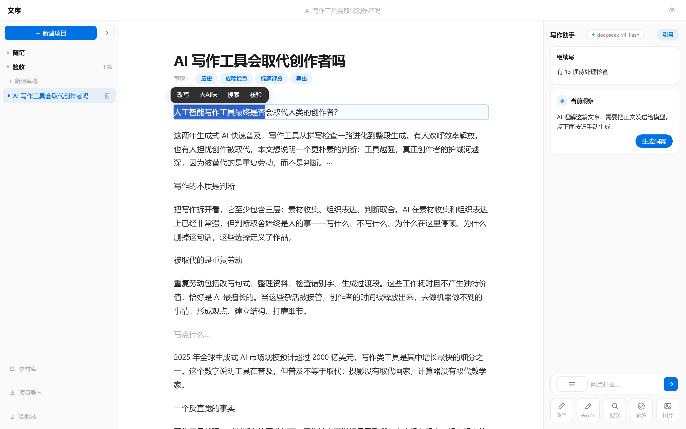

# 文序 Wensu · AI 原生写作系统

**作品是中心，人是作者，AI 是参谋。**

一个跑在你自己电脑上的 AI 写作工作台：写 3000 字观点长文，边查资料边写，成稿后逐项检查，导出干净的 Markdown。**你填自己的 API Key，花自己的钱，数据不出自己的电脑。**

[](https://github.com/zzz123123lll/wensu/actions/workflows/ci.yml)
[](https://github.com/zzz123123lll/wensu/releases/tag/v0.3.0)
Windows 10+ · 本地单机 · 自带 Key（BYOK） · 无云 · 无账号 · 不上传

---

## 它和"让 AI 帮你写"的区别

| 常见 AI 写作工具 | 文序 |
|---|---|
| 你给个标题，AI 吐一篇 | 你写，AI 在旁边递证据、递候选、挑毛病 |
| 一键生成，改起来无从下手 | 逐项确认，每次改动可撤销、留版本 |
| 事实靠模型自信 | 每句主张可查：引用 → 来源 → 核验，搜不到就明说"待核实" |
| 你的文章上传云端 | 正文只在本机，Key 系统级加密 |

三条硬原则：**AI 未经确认写入正文 = 0** · **问题在哪，结果就出现在哪** · **外面简单，里面复杂**。

## 界面

三栏工作台：左项目树 · 中写作区 · 右写作助手面板（非对话形态）。





选中任何文字，就地浮出工具条——改写 / 去 AI 味 / 搜索 / 核验，结果就地展开：



## 核心能力

- **写作**：Block 编辑器（标题/列表/引用/代码/图片/分割线）、自动保存状态机、中文输入法友好、撤销/版本历史/回收站
- **查资料**：联网搜索 + 中文多引擎（Bing/360/搜狗/百度）并发；句级核验（可信 / 存疑 / 建议修改）；引用落库带证据快照
- **成稿检查**：格式 / 语言 / 内容 / 事实与引用四类问题逐项列出，每条可定位、可解释、可追溯规则来源；含敏感词扫描与 AI 高频表达检测（本地词表，不回显命中词）
- **AI 助手面板**：洞察（AI 读你的稿说缺什么）、Ask 流式问答（回答可插入正文/存为素材）、改写与去 AI 味（候选制）、标题评分（打分 + 候选，点"采用"才写回）
- **证据链**：主张 → 引用 → 来源 → 核验六态；正文改动了，引用自动标"需复查"；模型知识永远打"模型知识"徽章，不冒充实时检索
- **素材库**：粘贴网址一键剪藏（可溯源）；标签检索；素材与正文的每次使用都有记录
- **通用发布**：发布目标管理（Webhook / 本地目录，配置加密存本机）+ 发布面板（选目标与格式、复制 HTML 到剪贴板、发布历史诚实记录）
- **新手引导**：起始页三步起步卡（配模型/建稿/选区 AI，自动打勾、可关闭）+ 右栏"技巧"速查
- **导出**：Markdown / 纯文本 / Word（含引用清单与来源附录）/ 公众号 HTML（4 套排版主题）/ 项目级 ZIP
- **多模型**：DeepSeek / OpenAI / 通义 / Kimi / 智谱 / 自定义端点，可按任务绑定不同模型

## 快速开始

**方式一：安装包（推荐，无需 Python）**

1. 到 [Releases](https://github.com/zzz123123lll/wensu/releases) 下载 `Wensu-Setup-v0.3.0.exe`；
2. 安装后双击 `Wensu.exe`（或开始菜单「文序」）→ 自动打开 http://127.0.0.1:8766；
3. 右上角 ⚙ 填你的模型 API 地址 / 模型名 / API Key；
4. 开写。数据在本机 `%APPDATA%\Wensu\`（数据库 / 图片 / 每日备份），卸载不丢。

**方式二：便携版** — 下载 `Wensu-v0.3.0-portable.zip`，解压双击 `Wensu\Wensu.exe`。

**方式三：源码（开发）**

```bash
py -3.12 -m venv .venv
.venv\Scripts\pip install -e ".[dev]"
wensu   # 或 python -m app.cli；任意工作目录可启动
```

## 安全与隐私

- 仅监听 `127.0.0.1`，别人电脑无法访问；Host 校验 + Origin 校验 + 随机 session token 三重守卫
- API Key 用 Windows DPAPI 加密存储；更换 API 地址自动清除旧 Key
- 抓取网页走 SSRF 防护；模型输出先校验再进界面；正文永远是不可信数据
- 诊断包不含正文 / Prompt / Key

## 工程质量

- **414 项后端测试 + 7 项前端单元 + 27 项浏览器 E2E + 12 项真实后端 E2E 全绿**
- 代码覆盖率 81.6%（门禁 ≥80%）；ruff 零错误
- GitHub Actions 双门禁：每次推送全量回归；打 tag 跑完整发布门禁（fail-closed）
- 发布产物带 sha256 校验值（见 Release 说明）

## 文档

- `docs/architecture.md` 架构与真相源
- `docs/api.md` API 契约
- `docs/data-migrations.md` 迁移 / 备份 / 恢复 / 回滚
- `docs/security.md` 安全边界
- `docs/testing.md` 测试体系

## 已知边界（如实说）

- 仅支持 Windows 本地单机；云端多用户版明确不做
- 搜索/核验/剪藏依赖本机外网可达；受限时降级为"模型知识"并诚实标注
- 素材语义检索（embedding）为已知遗留，当前为关键词 + 标签检索
- 公众号 HTML 导出中的本地图片需在公众号后台手动上传（平台限制）

## 反馈

用得不顺手、遇到 bug、想要某个功能，欢迎到 [Issues](https://github.com/zzz123123lll/wensu/issues) 留言——特别是真实写作场景里的卡点，那是这个项目最需要的东西。

---

*一个人从"脑子里有点东西"写到"一篇真正属于自己的作品"，AI 全程在场。*
